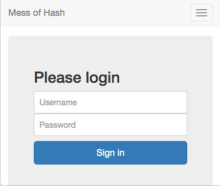

# WEB50: Mess of Hash

## Challenge
**Description:** Students have developed a new admin login technique. I doubt that it's secure, but the hash isn't crackable. I don't know where the problem is...

**Attachment:** [web50.zip](https://ctf.internetwache.org/files/web50.zip)

> All info I have is this:

```
<?php

$admin_user = "pr0_adm1n";
$admin_pw = clean_hash("0e408306536730731920197920342119");

function clean_hash($hash) {
    return preg_replace("/[^0-9a-f]/","",$hash);
}

function myhash($str) {
    return clean_hash(md5(md5($str) . "SALT"));
}

```

**Service:** https://mess-of-hash.ctf.internetwache.org/


## Solution

### Investigate PHP code
Looking at the PHP code, we can see that we have a hash for the admin user ``pr0_adm1n``. The function ``myhash()`` takes a string, most likely the password. 

In PHP, the following will return "True" because the values are being compared as integers:

```
<?php

if ('0e408306536730731920197920342119' == '0') {
  print "True";
}

?>
```

We need to find a password ``$str`` such that ``md5(md5($str) . "SALT"))`` returns a hash that begins with ``0e`` and ends with all digits (0-9).

web50-finder.py:

```
from hashlib import md5
import re
import sys

# clean_hash(md5(md5($str) . "SALT"));

salt = "SALT"
hash_regex = re.compile(r"^0e[0-9]+$")

with open(sys.argv[1], "rb") as ofile:
    for line in ofile:
        guess = line.rstrip('\n').rstrip('\r')
        final_result = md5(md5(guess).hexdigest() + salt).hexdigest()
        if hash_regex.match(final_result):
            print "%s results in  %s" % (guess, final_result)
```

We run ``web50-finder.py`` against ``bigdict.txt`` to find a password that matches our case:

```
$ python web50-finder.py bigdict.txt
macerasti1 results in  0e219660865882098154293079367705
```

We use the following to login and get the flag:

```
Username: pr0_adm1n
Password: macerasti1
```

Webpage contains the flag: 

```
IW{T4K3_C4RE_AND_C0MP4R3}
```
